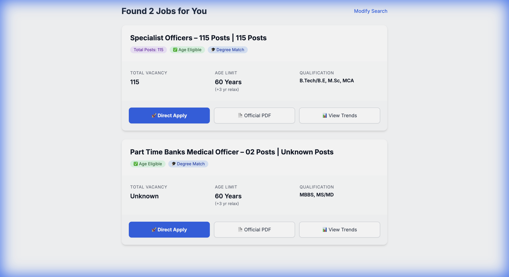

# SarkariMatch - The Eligibility Engine


> **Don't read 50-page PDFs. Let the engine decide if you are eligible.**

SarkariMatch is an intelligent job matching engine for Indian Government exams that scrapes FreeJobAlert, extracts eligibility criteria, and shows you **only** the jobs you qualify for based on your age, category, and qualification.

## 🎯 The Problem

Checking eligibility for government jobs is painful:
- Click through 50+ job notifications on FreeJobAlert
- Download each PDF to check age limits
- Manually calculate category relaxations (OBC +3 years, SC/ST +5 years)
- Find the actual "Apply Online" link buried in the notification

**Result:** Hours wasted, opportunities missed.

## ✨ Features

- **🔍 Deep Scraping**: Extracts actual vacancy numbers and direct application links (not just FreeJobAlert articles)
- **🧮 Smart Age Calculation**: Automatically applies category-based relaxations (OBC/SC/ST)
- **🎓 Qualification Matching**: Filters jobs by your degree (10th, 12th, Graduate, B.Tech, PG)
- **⚡ Fast Parallel Scraping**: Processes 15 jobs in ~3 seconds using ThreadPoolExecutor
- **🎨 Clean Dashboard UI**: See vacancy count, age limits, and action buttons at a glance
- **🔗 Direct Links**: Skip the middleman - get direct links to official application portals

## 📸 Screenshot



*Clean dashboard showing eligible jobs with vacancy badges, key stats, and direct apply buttons*

## 🚀 Quick Start

### Prerequisites
- Python 3.10+
- pip

### Installation

```bash
# Clone the repository
git clone https://github.com/yourusername/sarkari_match.git
cd sarkari_match

# Create virtual environment
python3 -m venv venv
source venv/bin/activate  # On Windows: venv\Scripts\activate

# Install dependencies
pip install -r requirements.txt
```

### Usage

1. **Scrape Latest Jobs**
   ```bash
   python scraper.py
   ```
   This generates `jobs.json` with 15 latest government job postings.

2. **Run the Web App**
   ```bash
   uvicorn main:app --reload
   ```

3. **Open in Browser**
   Navigate to `http://127.0.0.1:8000`

4. **Enter Your Details**
   - Date of Birth
   - Category (General/OBC/SC/ST)
   - Qualification

5. **Get Matched Jobs!**
   See only the jobs you're eligible for with direct apply links.

## 📁 Project Structure

```
sarkari_match/
├── scraper.py          # Deep scraper for FreeJobAlert
├── main.py             # FastAPI application & matching engine
├── templates/
│   ├── index.html      # Input form
│   └── results.html    # Job results dashboard
├── jobs.json           # Scraped job data (generated)
├── requirements.txt    # Python dependencies
└── README.md
```

## 🛠️ How It Works

### 1. Scraping (`scraper.py`)
- Fetches latest jobs from FreeJobAlert
- For each job, visits the detail page
- Extracts:
  - **Vacancy Count**: From title or "Total Vacancy" text
  - **Age Limits**: Min/Max age with regex patterns
  - **Direct Apply Link**: First external "Click here" link (filters out Telegram/WhatsApp)
  - **Notification PDF**: Official notification document

### 2. Matching Engine (`main.py`)
- Calculates user's age from DOB
- Applies category-based relaxations
- Filters jobs by:
  - Age eligibility (with relaxation)
  - Qualification match
- Returns sorted results

### 3. UI (`templates/`)
- Clean, modern dashboard
- Displays:
  - Job title with vacancy count
  - Eligibility badges
  - Key stats grid (Vacancy, Age Limit, Qualification)
  - Action buttons (Direct Apply, Official PDF, View Trends)

## 🗺️ Roadmap

We need help with these features! PRs welcome:

- [ ] **Physical Standards Parsing**: Extract height/chest requirements for police/defense jobs
- [ ] **Admit Card Notifications**: Track and notify when admit cards are released
- [ ] **Exam Date Extraction**: Parse "Last Date to Apply" and "Exam Date"
- [ ] **Previous Year Cutoff**: Scrape and display previous year cutoff marks
- [ ] **Multi-Source Scraping**: Add support for other job portals (SarkariResult, Employment News)
- [ ] **Email Alerts**: Send daily digest of new matching jobs
- [ ] **Mobile App**: React Native or Flutter app
- [ ] **Bookmark Jobs**: Save jobs for later review
- [ ] **Application Tracker**: Track which jobs you've applied to

## 🤝 Contributing

We welcome contributions! Please see [CONTRIBUTING.md](CONTRIBUTING.md) for guidelines.

Quick contribution ideas:
- Improve regex patterns for better data extraction
- Add new job portals
- Enhance UI/UX
- Write tests
- Improve documentation

## 📝 License

This project is licensed under the MIT License - see the [LICENSE](LICENSE) file for details.

## 🙏 Acknowledgments

- Data source: [FreeJobAlert](https://www.freejobalert.com)
- Built with [FastAPI](https://fastapi.tiangolo.com/)
- UI styled with [Tailwind CSS](https://tailwindcss.com/)

## ⚠️ Disclaimer

This tool is for educational purposes. Always verify eligibility criteria from official notifications before applying.

## 📧 Contact

For questions or suggestions, please open an issue on GitHub.

---

**Made with ❤️ for job seekers across India**
